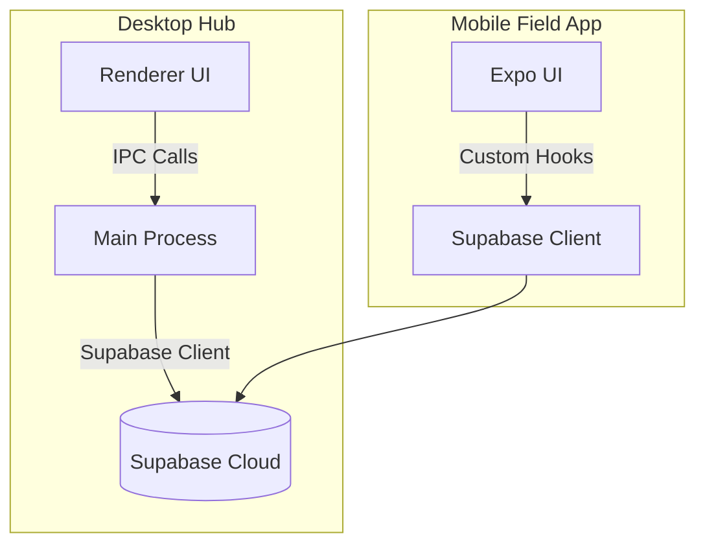
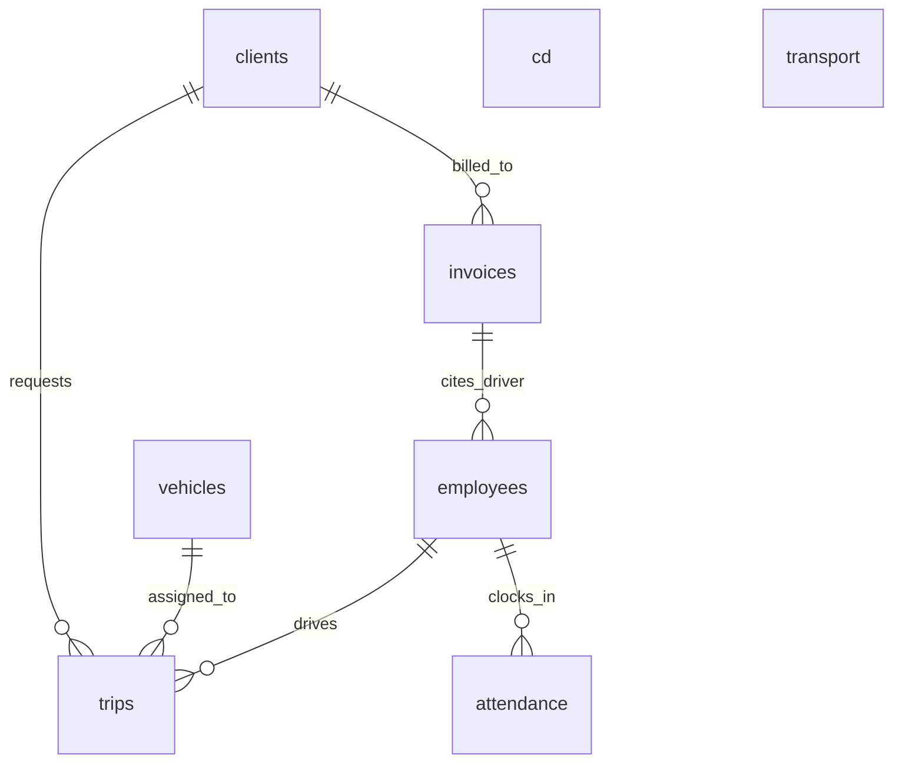
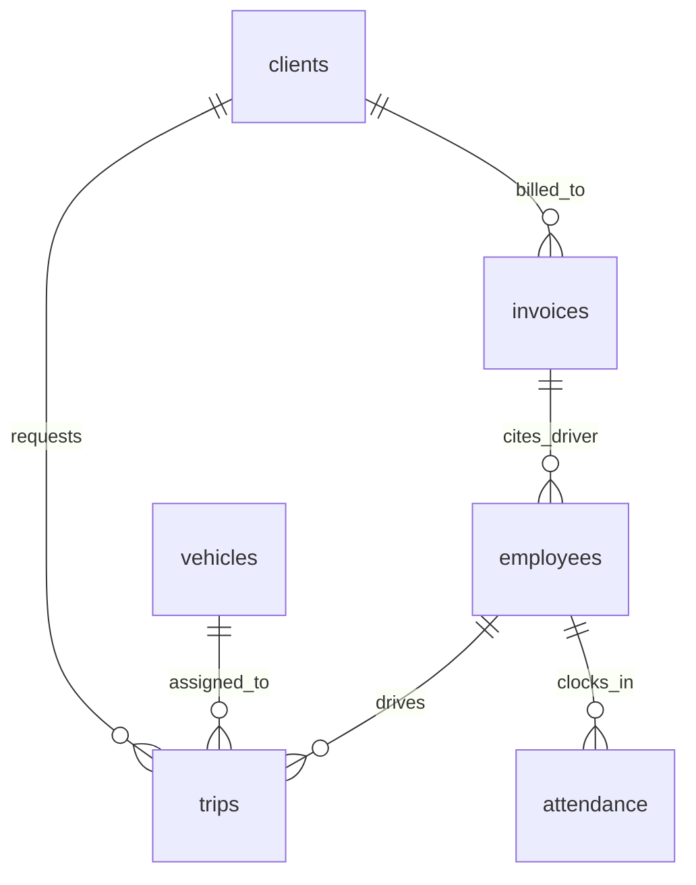

# JRR Transport System: Technical Developer Documentation


A professional, enterprise-grade logistics and fleet management suite. This repository contains a dual-application architecture designed to synchronize administrative oversight with real-time field operations.

---

##  Quick Start

### Prerequisites

* Node.js (v18+)
* PHP (v8+)
* MySQL
* Expo CLI
* Supabase account

### Run Desktop App

```bash
cd transport-app
npm install
npm run dev
```

### Run Mobile App

```bash
cd transport_mobile_app
npm install
npx expo start
```

---

##  System Data Flow

1. Mobile app sends attendance/trip data → Supabase
2. Desktop app fetches real-time updates via IPC handlers
3. IPC layer processes and synchronizes data to the UI
4. Reporting module aggregates and exports system data



**Core Technologies:**

* Supabase (Realtime + Auth)
* Electron IPC (Secure bridge)
* REST / Client SDK communication

---

##  Security Architecture

* Context Isolation enabled (Electron)
* Renderer has no direct Node.js access
* All access routed via `contextBridge`
* Environment variables secured via `.env`
* Supabase handles authentication and token validation

**Potential Risks:**

* Improper IPC exposure
* Environment leakage in production builds

---

##  Environment Configuration

Create a `.env` file inside `/transport-app`:

```env
SUPABASE_URL=your_project_url
SUPABASE_KEY=your_anon_key
```

 Never commit this file to version control.

### Step-by-Step Setup
1. **Initialize Supabase**: Create a new project at [database.new](https://database.new).
2. **Apply Schema**: Copy the contents of `sql/database/sql.sql` and run them in the Supabase SQL Editor.
3. **Retrieve Keys**: Go to **Project Settings** > **API**. Copy the `Project URL` and `anon public` key.
4. **Local Config**: Create `/transport-app/.env` and paste your keys.
5. **Mobile Config**: The mobile app also uses these keys; ensure `transport_mobile_app/lib/supabase.ts` is correctly pointing to your project.

---

##  Testing Strategy

**Planned:**

* Unit testing for IPC modules (Jest)
* Integration testing for Supabase interactions
* UI testing for critical workflows

**Current Status:**

* Manual testing across desktop and mobile environments

---

##  Performance Considerations

* Modular IPC prevents main-thread blocking
* ASAR packaging improves file read performance
* Supabase enables scalable real-time updates
* Expo Router supports lazy-loaded navigation

**Future Optimization:**

* Query caching layer
* Background sync (offline-first support)

---

##  Known Issues

* Dashboard recent dispatch not rendering consistently
* Fleet activity dropdown not responding
* Employee form validation inconsistency
* Report export may fail silently when dataset is empty
* Occasional input field freeze in registration module

---

##  Roadmap

### v1.2

* Real-time GPS fleet tracking
* Push notifications (Expo + Firebase)
* Advanced analytics dashboard

### v2.0

* Microservices backend (Node.js / Go)
* Role-based dynamic dashboards
* Offline-first mobile support

### Long-Term

* AI-based route optimization
* Predictive vehicle maintenance

---

##  Contributing

1. Fork the repository
2. Create a feature branch
3. Follow existing folder/module structure
4. Submit a pull request

**Coding Standards:**

* Modular IPC design
* Clear separation of concerns
* Consistent naming conventions

---

##  Core Logic & Identity Rules

The system enforces specific naming and authentication conventions to ensure data integrity across desktop and mobile platforms:

### Employee ID Generation
* **Pattern**: `EMPXXXX` (e.g., `EMP0008`).
* **Auto-Sequence**: The system caches existing employees and computes the "Next ID" by parsing the highest numerical suffix and incrementing it.

### PIN and Auth Mapping
* **Employee PIN**: Derived from the last 4 digits of the `employee_id`.
* **Auth Password**: Automatically salted and prefixed as `EMP` + `PIN4`. 
* **Database Triggers**: Fields like `employee_pin4` are database-generated to maintain a single source of truth for the Mobile check-in logic.

---

##  UI Performance Patterns

To ensure a premium, "lag-free" experience, the desktop hub utilizes several UX strategies:

* **The Loading Guard**: A global `loading-overlay` is used during all IPC transitions. It includes a minimum threshold of **500ms** to prevent the UI from flickering if a database call returns instantaneously.
* **Global List Caching**: Critical datasets (like the Employee Master List) are cached in the window context. This allows for **search-as-you-type** filtering with zero latency, as the filtering logic operates on the local cache rather than making repeated database queries.

---

##  Design System

The system uses a variable-based design system powered by **HSL (Hue Saturation Lightness)** tokens. This allows for rapid theme switching and consistent UI across all 17 desktop modules.

* **Core tokens:** Found in `transport-app/renderer/css/variables.css`.
* **Theming logic:** Handled by `renderer/js/theme.js`.
* **Shared styles:** Common layouts are stored in `renderer/css/shared.css`.

---

##  Database Architecture

The system's single source of truth is a **PostgreSQL** database hosted on **Supabase**.

* **Schema definitions:** Located in the `sql/database/sql.sql` file.
* **Key Entities:** Employees, Vehicles, Trips, Attendance, Invoices, Clients.
* **Real-time:** The mobile app utilizes Supabase's Realtime subscriptions for instant notification delivery.

---

## Full Project Architecture & File Hierarchy

The system is split into two primary workspaces: the **Desktop Administrative Hub** and the **Mobile Field Application**.

### Desktop Hub (`transport-app/`)

The desktop environment follows the **Electron Main-Renderer Isolation** model, now modernized with a modular IPC layer.

| Folder / File    | Purpose           | Technical Detail                                              |
| :--------------- | :---------------- | :------------------------------------------------------------ |
| **`main.ts`**    | Application Entry | Bootstraps Electron, manages window lifecycle and installers. |
| **`preload.ts`** | Security Bridge   | Exposes validated functions via `contextBridge`.              |
| **`ipc/`**       | **Logic Backend** | Modular IPC handlers interacting with Supabase and FS.        |
| ├── `index.ts`   | Central Registry  | Registers handlers during `app.whenReady`.                    |
| ├── `auth.ts`    | Auth Controller   | Dual-layer login (Supabase + fallback).                       |
| ├── `utils.ts`   | Sys Utilities     | `.env` loading, path resolution, Supabase init.               |
| ├── `payroll.ts` | Financial Logic   | Salary computation and deductions.                            |
| **`renderer/`**  | **Frontend UI**   | Decoupled HTML/CSS/JS interface.                              |
| ├── `html/`      | View Modules      | 17 modules including dashboard and scheduling.                |
| ├── `js/`        | Controllers       | DOM logic and IPC calls.                                      |
| └── `css/`       | Design System     | HSL-based styling system.                                     |
| **`assets/`**    | Media             | Icons, branding, splash assets.                               |
| **`.env`**       | Config            | Supabase credentials.                                         |

#### Shared Logic Domains (`ipc/`)
* **`auth.ts`**: High-security login logic with Supabase session management.
* **`vehicles.ts`**: CRUD operations and status management for the fleet.
* **`employees.ts`**: HR logic and position-based access control.
* **`payroll.ts`**: Automated daily/monthly salary calculation engine.
* **`billing.ts`**: Invoicing and payment status tracking.

---

### Mobile Application (`transport_mobile_app/`)

Built with **Expo** and file-based routing.

| Folder / File     | Purpose      | Technical Detail             |
| :---------------- | :----------- | :--------------------------- |
| **`app/`**        | **Router**   | Maps files to screens        |
| ├── `(tabs)/`     | Core Modules | Dashboard, trips, attendance |
| └── `auth/`       | Entry        | Login/Register               |
| **`contexts/`**   | State        | Global state (AuthContext)   |
| **`lib/`**        | Infra        | Supabase client              |
| **`components/`** | UI           | Reusable components          |
| **`hooks/`**      | Logic        | Data hooks                   |
| **`eas.json`**    | Build        | APK config                   |
| **`app.json`**    | Manifest     | Metadata                     |

#### Custom Logic Hooks (`hooks/`)
* **`useAuth.ts`**: Global authentication state and session restoration.
* **`useTrips.ts`**: Real-time trip status synchronization.
* **`useAttendance.ts`**: Location-aware check-in/out logic.

---

## Module & Page Functional Directory

### Desktop Central Hub (17 Modules)

Acts as the operational brain.

| Module              | Function          |
| :------------------ | :---------------- |
| Dashboard           | Real-time stats   |
| Employee Management | HR control        |
| Vehicles            | Fleet tracking    |
| Scheduling          | Dispatch system   |
| Attendance          | Logs              |
| Payroll             | Salary automation |
| Billing             | Invoicing         |
| Reports             | Data export       |
| Graphs              | Analytics         |

---

### Mobile Operation Hub (8 Modules)

| Module        | Function         |
| :------------ | :--------------- |
| Dashboard     | Daily overview   |
| Trips         | Dispatch viewer  |
| Attendance    | GPS check-in     |
| Paycheck      | Salary breakdown |
| Requests      | HR tickets       |
| Profile       | Account          |
| Notifications | Alerts           |

### Mobile State & Resiliency
The mobile app relies on a robust `AuthContext` to manage field operations:
* **Session Restoration**: On startup, the app attempts to hydrate the Supabase session with a **10-second watchdog timer** to prevent loading loops in dead zones.
* **Offline Mock Session**: If the network is unavailable during restoration, the app falls back to a locally cached `AsyncStorage` session, allowing users to reach their dashboard and view pre-synced trip data.
* **Navigation Guards**: Route-based protection ensures users are redirected to the Login flow if their session identity cannot be verified against the `employees` table.

---

##  Database Relational Overview

The system architecture is strictly relational, ensuring cascading integrity for logistics and financial data:



---

---

##  Renderer IPC API Reference

The Desktop Hub uses a secure IPC bridge. Frontend developers can access backend logic via the `window.api` object.

| Category | Method | Description |
| :--- | :--- | :--- |
| **Auth** | `login(email, password)` | Authenticates user via Supabase. |
| | `register(data)` | High-level admin registration. |
| **Employees** | `getEmployees()` | Returns full list of drivers and staff. |
| | `updateEmployee(id, data)` | Updates existing record. |
| | `createEmployee(payload)` | Comprehensive employee + account creation. |
| **Vehicles** | `getVehicles()` | Fetches entire fleet directory. |
| | `setVehicleStatus(id, status)`| Updates vehicle operational state. |
| **Trips** | `getTrips()` | Lists all logistics operations. |
| | `updateTripStatus(id, state)` | Updates progress (scheduled -> completed). |
| | `deleteTrip(id)` | Removes trip and releases resources. |
| | `updateTrip(id, data)` | Full update of trip details. |
| **Dashboard** | `getDashboardStats()` | Aggregates KPIs for the landing view. |
| **Billing** | `billing.getAll()` | Retrieves all client invoices. |
| | `billing.getLastNumber()` | Gets next invoice ID for sequencing. |
| **Payroll** | `payroll.getMonthlyAll()` | Computes organizational earnings report. |
| | `payroll.finalize(month)` | Persistent snapshot of paychecks + mobile sync. |
| **Attendance**| `getAllAttendance(opts)` | Filterable time-log repository. |
| **Notifications**| `notifications.broadcast(data)`| Sends alert to all mobile drivers. |
| | `notifications.getAll()` | Fetches system-wide history. |
| **Realtime** | `onRealtime(callback)` | Subscribe to shared system events via WebSockets. |

---

---

## System Stabilization & Functional Gap Fixes (v1.2)

###  Administrative Logistics & Payroll
* **Payroll Finalization Pipeline**: Implemented a robust "Finalize & Publish" workflow. Payroll data is now captured as a persistent snapshot in the `paychecks` table, allowing drivers to view historical salary records on mobile.
* **Full Trip CRUD**: Added "Edit" and "Delete" capabilities to the desktop Scheduling module, ensuring automatic resource release (drivers/vehicles) upon trip cancellation or modification.
* **Expanded Reporting**: The Reports module now supports comprehensive CSV exports for Employees, Attendance, Invoices, Clients, and Monthly Payroll history.

###  Field Communications (Mobile Sync)
* **Real-time Notification Engine**: Created a cross-platform notification system. Drivers receive automated push-style alerts for trip assignments and time-off request status changes.
* **Driver Lifecycle Actions**: Drivers can now independently update trip progress via "Start Trip" and "Mark Delivered" actions directly in the mobile UI.
* **UI/UX Refinements**: 
    * Native currency symbol support (`₱`).
    * Production-ready visibility toggles (hiding debug tools in non-dev builds).

###  Core Stability Fixes
* **TypeScript Hardening**: Resolved critical type-inference errors across `ipc/requests.ts` and mobile `trips.tsx`.
* **Security Guard Strengthening**: The `auth_guard.js` now implements auto-execution and redirect-loop protection for administrative sessions.
* **Real-time Synchronization**: Expanded WebSocket subscriptions in the main process to include Invoices, Clients, Attendance, and Notifications.

---

## Distribution & Deployment Guide

### Desktop App

```bash
npm run make
```

Output: `transport-app/out/make/.../Setup.exe`

### Mobile APK

$env:EAS_NO_VCS=1; npx eas-cli build -p android --profile preview
```

### Build Optimization Details
* **Electron Forge (ASAR)**: The desktop app is bundled into an **Electron Archive (ASAR)**. This protects the source code from tampering and improves file read performance by flattening the `node_modules` directory into a single package.
* **EAS Build Profiles**: 
    * `preview`: Generates a standard **APK** for direct sideloading and internal testing.
    * `production`: Generates an **Android App Bundle (AAB)** optimized for Google Play Store distribution.
* **Environment Bundling**: The `.env` file is marked as an `extraResource` in `forge.configc.js`, ensuring that the Supabase keys are correctly packaged inside the `resources/` folder of the final installer.

---

##  Production Readiness Checklist

Before moving the JRR Transport System into a production environment, ensure the following steps are completed:

- [ ] **Environment Sanity**: Verify `.env` keys in the packaged `resources/` folder are pointing to the production Supabase instance.
- [ ] **ASAR Verification**: Ensure `asar: true` is set in `forge.configc.js` for source code protection.
- [ ] **Security**: Verify that `nodeIntegration` is `false` and `contextIsolation` is `true` in `main.ts`.
- [ ] **Mobile Credentials**: Check that the `google-services.json` (if applicable) and EAS credentials are up to date.
- [ ] **Build Cleanup**: Run `npm run clean` (if available) or delete `out/` and `dist/` folders to ensure a fresh build.
- [ ] **Database RLS**: Verify that Supabase Row Level Security (RLS) policies are active and correctly limiting access by `auth.uid()`.

---

##  Developer Deep Dive: How it Works

###  The IPC Request Lifecycle
The Desktop Hub uses a strictly decoupled communication pattern for security:
1. **Renderer (UI)**: Dispatches a call like `window.api.getVehicles()`.
2. **Preload Script**: Acts as a secure guard, marshalling the request into an `ipcRenderer.invoke('get-vehicles')`.
3. **Main Process**: A modular handler in `ipc/vehicles.ts` receives the signal and executes the query using the privileged `SUPABASE_KEY`.
4. **Data Return**: The result is passed back across the bridge. This ensures the frontend **never** touches environment variables or raw database credentials.

###  Mobile Auth & Resiliency
The mobile app (`transport_mobile_app`) is built to handle unstable field conditions:
* **PIN-to-Password Transformation**: For ease of use, drivers login with a 4-digit PIN. The `AuthContext.tsx` automatically salts and prefixes this (`EMP` + `PIN`) to form the secure Supabase password.
* **Safety Timeout**: A 10-second watchdog timer prevents the "forever loading" state if the Supabase auth service is secondary or slow.
* **Mock Session Fallback**: If the network fails during session restoration, the app falls back to a locally cached session in `AsyncStorage`, allowing drivers to continue their routes offline.

###  Entity Relations (High Level)
The database architecture follows a clean relational model for logistics:


###  Theming via HSL Tokens
Instead of static hex codes, the system uses **HSL (Hue, Saturation, Lightness)** variables. Switching the system's "Mood" is as simple as updating `--primary-h` in `variables.css`. All components (cards, buttons, alerts) automatically re-calculate their border and shadow intensities using CSS `calc()`.

---

##  Troubleshooting

### Desktop App
* **Error: Cannot find module 'electron'**: Run `npm install` inside `transport-app`.
* **White Screen on Launch**: Check `.env` for valid Supabase credentials.
* **IPC Errors**: Ensure functions are registered in `ipc/index.ts` and exposed in `preload.ts`.

### Mobile App
* **EAS Build Fails**: Ensure you are using the `$env:EAS_NO_VCS=1` flag if not using Git control.
* **Network Request Failed**: Check Supabase URL and network connectivity.
* **Expo Router Issues**: Run `npx expo customize metro.config.js` if routing fails.

---
## super admin acc
admin@jrr.com and admin
*Maintained by JRR Transport Engineering*
