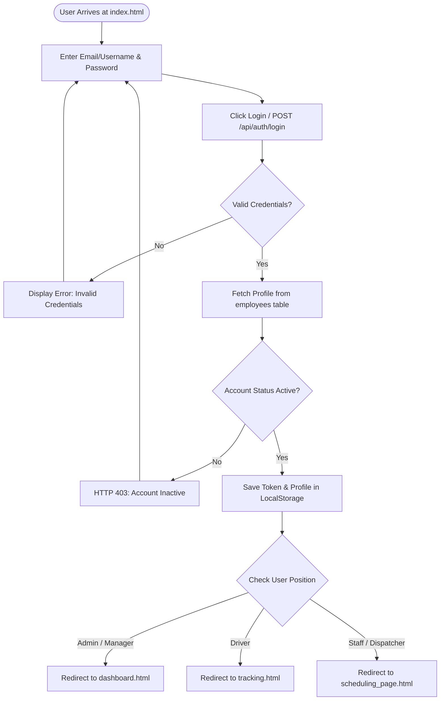
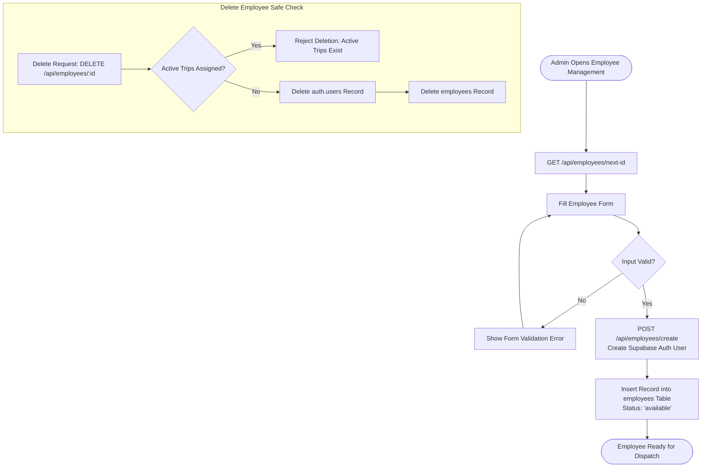
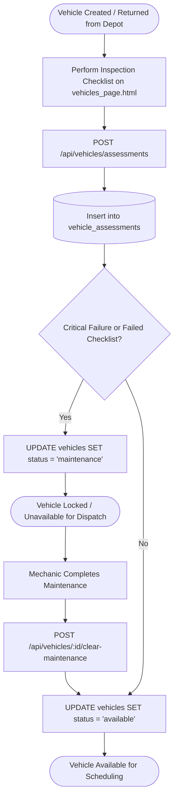
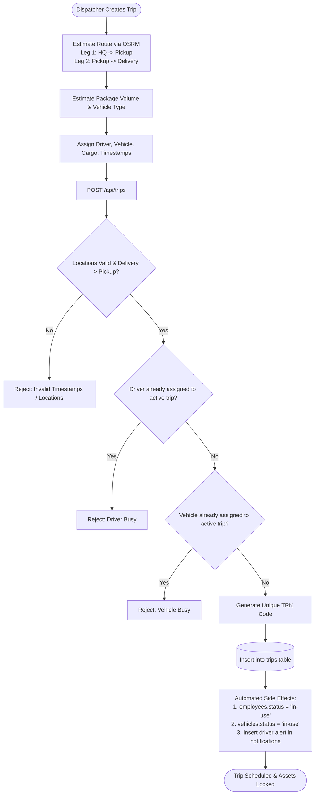
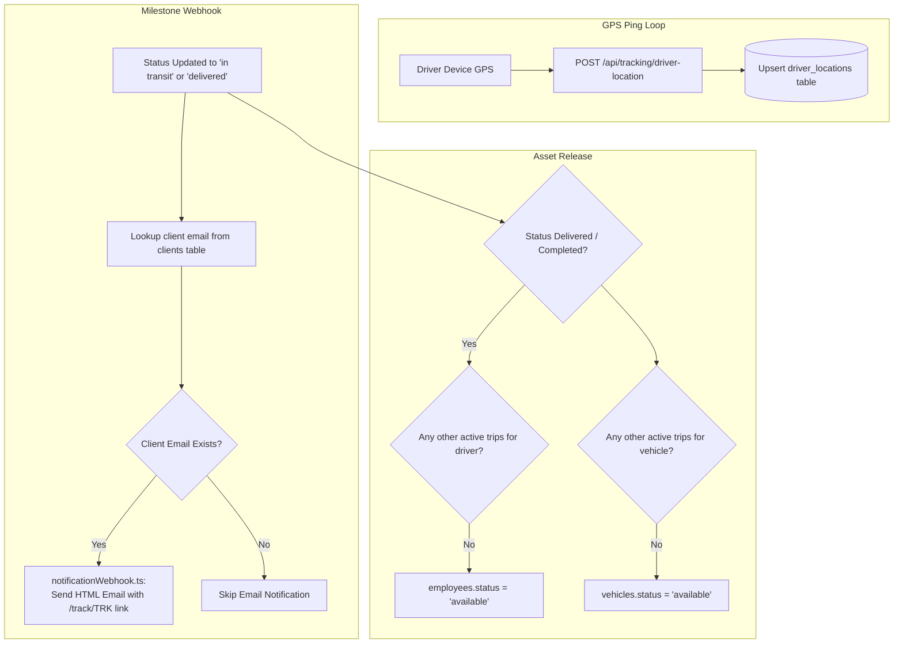
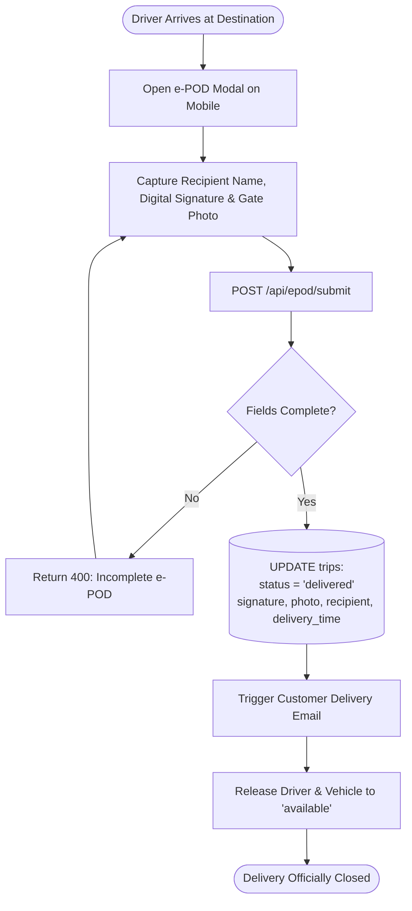
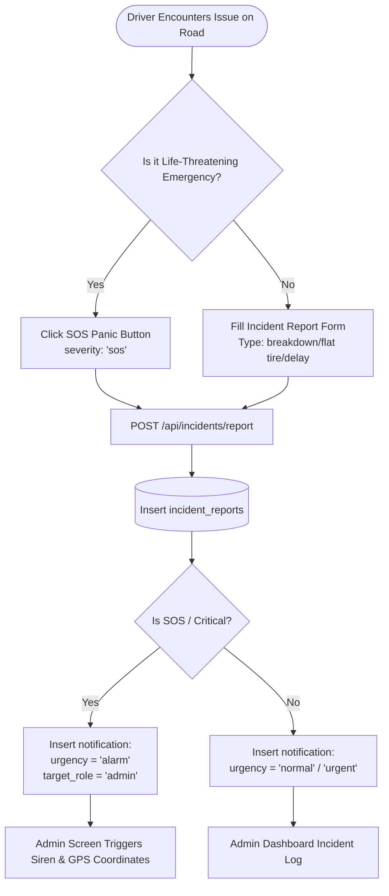
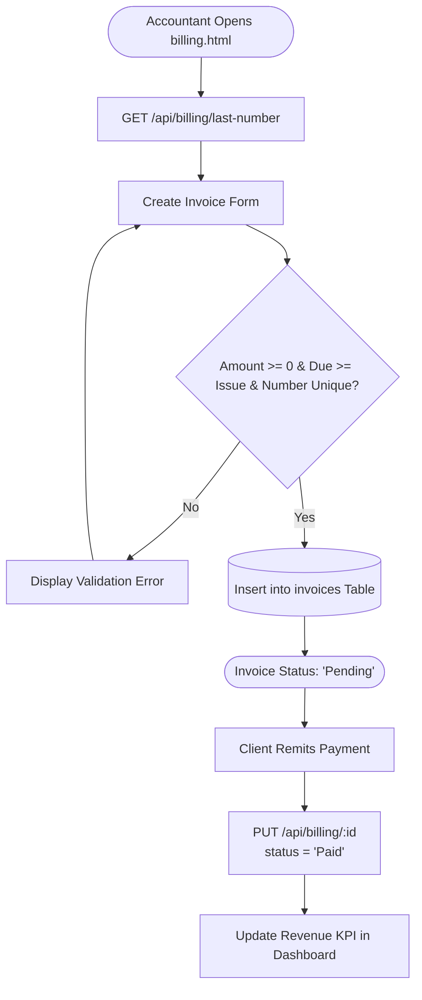

# JRR Transport Logistics Management System — Complete Process & Flowchart Blueprint

This document contains the complete, unexempted analysis of **all 13 operational processes, sub-processes, API endpoints, decision diamonds, validations, and database state transitions** across the entire transport management system.

---

## Master Architecture & System Domain Overview

```mermaid
flowchart TB
    subgraph Users ["System Actors & Users"]
        A[Admin / HR / Management]
        D[Driver / Field Staff]
        OP[Dispatcher / Operations]
        C[Client / Public Customer]
    end

    subgraph CoreFrontend ["Frontend Web Applications (HTML/JS)"]
        P1["Auth & Session (index.html)"]
        P2["Fleet & Pre-Trip (vehicles_page.html)"]
        P3["Scheduling (scheduling_page.html)"]
        P4["Live Tracking & e-POD (tracking.html)"]
        P5["Public Tracking (public_track.html)"]
        P6["Billing & Invoices (billing.html)"]
        P7["Payroll & Tax (payroll_management.html)"]
        P8["Attendance & Leave (attendance_monitoring_page.html)"]
        P9["Dashboard & Analytics (dashboard.html)"]
    end

    subgraph BackendAPI ["Express.js API Engine (server.ts)"]
        R1["/api/auth"]
        R2["/api/employees"]
        R3["/api/vehicles"]
        R4["/api/trips"]
        R5["/api/tracking"]
        R6["/api/epod"]
        R7["/api/incidents"]
        R8["/api/expenses"]
        R9["/api/billing"]
        R10["/api/requests"]
        R11["/api/notifications"]
        R12["/api/public-tracking"]
    end

    subgraph DatabaseCloud ["Supabase PostgreSQL Cloud"]
        T1[(users & auth.users)]
        T2[(employees & attendance)]
        T3[(vehicles & vehicle_assessments)]
        T4[(trips & driver_locations)]
        T5[(incident_reports & trip_expenses)]
        T6[(invoices & clients)]
        T7[(notifications & time_off_requests)]
    end

    subgraph External ["External Services"]
        EXT1[OSRM Routing / OpenStreetMap]
        EXT2[SendGrid / SMTP Email Webhook]
    end

    Users --> CoreFrontend
    CoreFrontend --> BackendAPI
    BackendAPI --> DatabaseCloud
    BackendAPI --> External
```



---

## Detailed Process Catalog

---

### Process 1: Authentication, Role-Based Access & Session Management

* **Actors**: Admin, Manager, Dispatcher, Driver, Staff
* **Frontend File**: `renderer/html/index.html`, `renderer/html/forgot_password_page.html`
* **API Route**: `server/routes/auth.routes.ts`
* **Database Tables**: `auth.users`, `users`, `employees`

#### Step-by-Step Execution:
1. User enters identifier (email or username) and password on `index.html`.
2. UI submits credentials to `POST /api/auth/login`.
3. Server executes `supabase.auth.signInWithPassword({ email, password })`.
4. **Decision 1 (Valid Auth)**:
   * **Failure**: Return HTTP 401 with error message. Alert displayed to user; remains on login screen.
   * **Success**: Supabase returns `access_token` and `user.id`.
5. Server queries `employees` table where `supabase_user_id == user.id`.
6. **Decision 2 (Account Status)**:
   * **Inactive/Suspended**: Return HTTP 403 (`"Account is deactivated"`).
   * **Active**: Return user profile (`full_name`, `position`, `department`, `status`).
7. Client stores session in `localStorage` (`session_user`, `token`).
8. **Decision 3 (Role-Based Route)**:
   * If `Admin` or `Manager` $\rightarrow$ Redirect to `dashboard.html`.
   * If `Driver` $\rightarrow$ Redirect to `tracking.html` or Driver Tasks.
   * If `Staff` / `Dispatcher` $\rightarrow$ Redirect to `scheduling_page.html`.
9. **Password Reset Branch**:
   * User navigates to `forgot_password_page.html`.
   * Enters email $\rightarrow$ Calls `POST /api/auth/forgot-password`.
   * Supabase dispatches email reset link with recovery token $\rightarrow$ User updates password.



---

### Process 2: Employee Lifecycle & Automated Identity Provisioning

* **Actors**: Admin, HR Officer
* **Frontend File**: `renderer/html/employee_management.html`
* **API Route**: `server/routes/employees.routes.ts`
* **Database Tables**: `employees`, `auth.users`, `trips`

#### Step-by-Step Execution:
1. Admin opens `employee_management.html` and clicks **Add Employee**.
2. Client sends request to `GET /api/employees/next-id`.
   * Server queries all existing `employee_id` values, extracts numeric component (e.g., `EMP0007`), computes `max + 1`, and returns next formatted code (`EMP0008`).
3. Admin inputs: Full Name, Email, Phone, Position, Department, Daily Rate, Monthly Salary, and initial password.
4. **Validation Step**:
   * Verify Full Name and Email are present.
   * Validate Email format using regular expressions.
   * Verify `daily_rate >= 0` and `salary >= 0`.
   * **Decision 1 (Valid Input)**: If invalid $\rightarrow$ Return HTTP 400.
5. Admin submits to `POST /api/employees/create`.
6. Server uses Supabase Admin API (`supabaseAdmin.auth.admin.createUser`) to create an authenticated login account.
7. Server creates matching record in `employees` table:
   * Sets `employee_id`, `supabase_user_id`, initial `status: "available"`, and `hire_date: CURRENT_DATE`.
8. **Deletion Protection Flow** (`DELETE /api/employees/:id`):
   * System checks `trips` table where `driver_id == id` and `status IN ('pending', 'scheduled', 'in transit')`.
   * **Decision 2 (Active Trips?)**:
     * **YES**: Block deletion with HTTP 400: `"Cannot delete: employee has active trip assignments."`
     * **NO**: Delete Supabase Auth account via Admin API $\rightarrow$ Delete row from `employees`.



---

### Process 3: Vehicle Fleet Onboarding, Inspection Checklist & Maintenance Lock

* **Actors**: Fleet Manager, Driver, Inspector
* **Frontend File**: `renderer/html/vehicles_page.html`
* **API Route**: `server/routes/vehicles.routes.ts`
* **Database Tables**: `vehicles`, `vehicle_assessments`, `trips`

#### Step-by-Step Execution:
1. **Vehicle Onboarding** (`POST /api/vehicles`):
   * Fleet manager enters Plate Number, Vehicle Type, Brand, Model, Capacity.
   * **Decision 1 (Plate Exists?)**:
     * If plate exists in database $\rightarrow$ Reject with HTTP 400 duplicate error.
     * If unique $\rightarrow$ Insert row into `vehicles` with `status: "available"`.
2. **Pre-Trip / Post-Trip Inspection** (`POST /api/vehicles/assessments`):
   * Inspector/Driver completes inspection checklist: Odometer reading, Fuel level percentage, Brakes, Tires, Lights, Fluid levels, Battery, Damage photos, and notes.
3. **Safety Quarantine Evaluation**:
   * Assessment inserted into `vehicle_assessments`.
   * **Decision 2 (Inspection Result)**:
     * If `has_critical_failure == true` OR `status == 'failed'`:
       * System immediately runs `UPDATE vehicles SET status = 'maintenance' WHERE id = vehicle_id`.
       * The vehicle is locked from being scheduled for any new trips.
     * Else: Vehicle remains `available` (or `in-use`).
4. **Maintenance Sign-Off** (`POST /api/vehicles/:id/clear-maintenance`):
   * After mechanics complete repairs, Manager reviews records and clicks "Clear Maintenance".
   * System updates `vehicles.status = 'available'`.
5. **Vehicle Deletion Cascade Guard** (`DELETE /api/vehicles/:id`):
   * Check `trips` table for ongoing trips. If active $\rightarrow$ Reject deletion.



---

### Process 4: Client Accounts & Financial Dependency Safeguards

* **Actors**: Dispatcher, Billing Officer, Client
* **Frontend File**: `renderer/html/client_history_page.html`, `renderer/html/billing.html`
* **API Route**: `server/routes/clients.routes.ts`
* **Database Tables**: `clients`, `invoices`, `trips`

#### Step-by-Step Execution:
1. **Client Registration** (`POST /api/clients`):
   * Input: Company/Client Name, Contact Email, Contact Phone, Address.
   * **Decision 1 (Email Unique?)**:
     * If email already exists $\rightarrow$ Return error.
     * Else $\rightarrow$ Insert record into `clients`.
2. **Trip History Lookups** (`GET /api/clients/history?clientId=...`):
   * Dispatcher views all historical and active shipments for the client.
3. **Safe Deletion Cascade Check** (`DELETE /api/clients/:id`):
   * **Decision 2 (Unpaid Invoices?)**:
     * System checks `invoices` where `client_id == id` and `status IN ('Pending', 'Unpaid')`.
     * If unpaid invoices exist $\rightarrow$ Reject deletion: `"Client has unpaid invoices."`
   * **Decision 3 (Ongoing Deliveries?)**:
     * System checks `trips` where `client_id == id` and `status IN ('pending', 'scheduled', 'in transit')`.
     * If active trips exist $\rightarrow$ Reject deletion: `"Client has active trips in transit."`
   * If both checks pass $\rightarrow$ Client safely deleted.

---

### Process 5: Trip Booking, Route Calculation & Resource Conflict Allocation

* **Actors**: Dispatcher / Operations Officer
* **Frontend File**: `renderer/html/scheduling_page.html`
* **API Route**: `server/routes/trips.routes.ts`, `server/routes/tracking.routes.ts`
* **Database Tables**: `trips`, `employees`, `vehicles`, `notifications`

#### Step-by-Step Execution:
1. Dispatcher initiates shipment creation on `scheduling_page.html`.
2. **Dual-Leg Route Calculation** (`POST /api/tracking/estimate-route`):
   * Dispatcher selects Pickup Location and Delivery Destination.
   * System calls OSRM Route Service:
     * **Leg 1 (Dispatch)**: HQ Depot (Morong, Rizal) $\rightarrow$ Pickup Location.
     * **Leg 2 (Transit)**: Pickup Location $\rightarrow$ Final Delivery Destination.
   * Computes total distance (km), estimated transit time (mins), and polyline route coordinates.
3. **Volumetric & Vehicle Recommendation** (`POST /api/tracking/estimate-package`):
   * Calculates volumetric weight vs actual weight $\rightarrow$ Recommends appropriate truck type.
4. Dispatcher assigns Driver, Vehicle, and Client.
5. Dispatcher clicks **Schedule Trip** $\rightarrow$ `POST /api/trips`.
6. **Server Validations & Conflict Checks**:
   * Check 1: Pickup and Delivery locations present.
   * Check 2: Delivery time must be after pickup time.
   * **Conflict Check 3 (Driver Double-Booking)**:
     * Query `trips` for active trips where `driver_id == assigned` and `status IN ('pending', 'scheduled', 'in transit')`.
     * **Decision 1**: If driver busy $\rightarrow$ Reject with HTTP 400: `"Driver is already assigned to active trip(s)"`.
   * **Conflict Check 4 (Vehicle Double-Booking)**:
     * Query `trips` for active trips where `vehicle_id == assigned` and `status IN ('pending', 'scheduled', 'in transit')`.
     * **Decision 2**: If vehicle busy $\rightarrow$ Reject with HTTP 400: `"Vehicle is already assigned to active trip(s)"`.
7. **Trip Creation**:
   * Generate unique tracking code: `TRK-[8 random alphanumeric characters]`.
   * Insert record into `trips` with `status: "scheduled"` or `"pending"`.
8. **Automatic State Side Effects**:
   * Run `UPDATE employees SET status = 'in-use' WHERE id = driver_id`.
   * Run `UPDATE vehicles SET status = 'in-use' WHERE id = vehicle_id`.
   * Insert alert into `notifications` table for assigned driver: `"New Trip Assigned"`.



---

### Process 6: Live GPS Tracking & Automated Milestone Webhooks

* **Actors**: Driver Mobile App, Public Client, Dispatcher
* **Frontend File**: `renderer/html/tracking.html`, `renderer/html/public_track.html`
* **API Route**: `server/routes/tracking.routes.ts`, `server/routes/trips.routes.ts`, `server/routes/public_tracking.routes.ts`
* **Database Tables**: `driver_locations`, `trips`, `clients`, `employees`, `vehicles`

#### Step-by-Step Execution:
1. **Driver GPS Ping** (`POST /api/tracking/driver-location`):
   * Driver device sends: `driver_id`, `vehicle_id`, `trip_id`, `latitude`, `longitude`, `speed`, `heading`.
   * Upsert into `driver_locations` table with `updated_at: CURRENT_TIMESTAMP`.
2. **Public Shipment Inquiry** (`GET /api/public-tracking/:query`):
   * Customer enters tracking code or trip number on `public_track.html`.
   * Server resolves:
     * `trip` record details.
     * `employees` profile (driver full name, phone).
     * `vehicles` profile (plate, model).
     * `driver_locations` latest GPS position.
   * Client browser renders live map with car icon and destination pin.
3. **Milestone State Transitions** (`PATCH /api/trips/:id/status`):
   * Status updated: `pending` $\rightarrow$ `scheduled` $\rightarrow$ `in transit` $\rightarrow$ `delivered`.
4. **Milestone Customer Email Webhook** (`notificationWebhook.ts`):
   * Queries `clients` table using `trip.client_id`.
   * **Decision 1 (Client Email on Record?)**:
     * **YES**: Sends HTML email notification with direct tracking URL:
       * Status `in-transit`: *"Your delivery is on its way!"*
       * Status `delivered`: *"Your delivery has arrived!"*
       * Status `failed`: *"Delivery attempt unsuccessful."*
     * **NO**: Skips email without interrupting server response.
5. **Asset Release on Completion**:
   * **Decision 2**: Is new status `"completed"` or `"delivered"`?
     * **YES**:
       * If driver has no remaining active trips $\rightarrow$ `UPDATE employees SET status = 'available'`.
       * If vehicle has no remaining active trips $\rightarrow$ `UPDATE vehicles SET status = 'available'`.



---

### Process 7: Electronic Proof of Delivery (e-POD)

* **Actors**: Driver, Consignee / Recipient
* **Frontend File**: `renderer/html/tracking.html` (e-POD Modal)
* **API Route**: `server/routes/epod.routes.ts`
* **Database Tables**: `trips`

#### Step-by-Step Execution:
1. Driver arrives at consignee address and opens **Complete Delivery (e-POD)** modal.
2. Form captures:
   * Recipient printed full name.
   * Recipient digital canvas signature (`signatureData`).
   * Cargo handoff photo URL / upload.
   * Delivery remarks / condition notes.
3. Driver clicks **Submit e-POD** $\rightarrow$ `POST /api/epod/submit`.
4. **Validation Check**:
   * Ensure `tripId`, `recipientName`, and `signatureData` are provided.
   * If missing $\rightarrow$ Return HTTP 400.
5. Database execution:
   * System updates `trips` table:
     * `status = "delivered"`
     * `pod_recipient_name = recipientName`
     * `pod_signature_data = signatureData`
     * `pod_photo_url = photoUrl`
     * `pod_delivered_at = CURRENT_TIMESTAMP`
     * `delivery_time = CURRENT_TIMESTAMP`
6. Triggers customer milestone delivery confirmation email and releases driver/vehicle to `"available"`.



---

### Process 8: En-Route Incident & Emergency SOS Alerting

* **Actors**: Driver, Operations Admin / Safety Officer
* **Frontend File**: `renderer/html/tracking.html`
* **API Route**: `server/routes/incidents.routes.ts`
* **Database Tables**: `incident_reports`, `notifications`

#### Step-by-Step Execution:
1. Driver encounters unexpected event (flat tire, road hazard, breakdown, collision, cargo compromise, or personal safety threat).
2. Driver clicks **Report Incident** or **SOS Panic Button**.
3. Payload sent to `POST /api/incidents/report`:
   * `tripId`, `driverId`, `vehicleId`, `incidentType`, `severity` (`low`, `moderate`, `critical`, `sos`), `description`, GPS `latitude`, `longitude`, photos, police report number.
4. System records row in `incident_reports` table (`status: 'reported'`).
5. **Urgency Evaluation**:
   * **Decision 1**: Is `severity === 'sos'` OR `incidentType === 'sos_panic'`?
     * **YES**:
       * Create notification with `urgency = 'alarm'` and `title = "🚨 SOS EMERGENCY ALERT"`.
       * Admin dashboard plays audio alarm and displays red emergency banner with exact GPS coordinates.
     * **NO**:
       * Create notification with `urgency = 'urgent'` or `'normal'`.
6. Admin dispatches emergency roadside assistance or backup replacement vehicle.



---

### Process 9: En-Route Trip Expense & Fuel Logging

* **Actors**: Driver, Fleet Accountant
* **Frontend File**: `renderer/html/tracking.html`, `renderer/html/report_page.html`
* **API Route**: `server/routes/expenses.routes.ts`
* **Database Tables**: `trip_expenses`

#### Step-by-Step Execution:
1. Driver pays for fuel, tollway toll gate, or minor maintenance.
2. Submits expense via `POST /api/expenses/log`:
   * `tripId`, `driverId`, `vehicleId`, `expenseType`, `amount`, `liters`, `odometer`, receipt image URL, notes.
3. **Validation**: Check that `expenseType` is specified and `amount >= 0`.
4. Record inserted into `trip_expenses`.
5. **Fleet Expense Aggregation** (`GET /api/expenses/fleet-summary`):
   * Live calculation of:
     * Total Spent
     * Total Liters of Fuel
     * Total Toll Fees
     * Average Price Per Liter ($\frac{\text{Fuel Cost}}{\text{Liters}}$)
   * Expense records displayed on monthly financial balance sheets.

---

### Process 10: Invoicing, Billing & Accounts Receivable

* **Actors**: Billing Clerk / Accountant, Client
* **Frontend File**: `renderer/html/billing.html`
* **API Route**: `server/routes/billing.routes.ts`
* **Database Tables**: `invoices`, `clients`, `trips`

#### Step-by-Step Execution:
1. Billing Clerk opens `billing.html`.
2. System fetches next invoice recommendation via `GET /api/billing/last-number`.
3. Clerk enters: Invoice Number, Client ID, Trip ID, Amount, Issue Date, Due Date, Status.
4. **Validation Step**:
   * Amount must not be negative (`amount >= 0`).
   * Due Date must be on or after Issue Date (`due_date >= issue_date`).
   * **Decision 1 (Unique Invoice Number?)**:
     * If invoice number already exists in `invoices` $\rightarrow$ Reject with HTTP 400.
5. System inserts row into `invoices` (`POST /api/billing`).
6. **Payment Status Lifecycle** (`PUT /api/billing/:id`):
   * Invoice transitions: `Pending` $\rightarrow$ `Paid` (or `Overdue` / `Cancelled`).
7. Revenue Metrics (`GET /api/billing/stats`):
   * Computes Total Revenue from all `Paid` invoices and counts unpaid invoices.



---

### Process 11: Attendance & Time-Off Lifecycle

* **Actors**: Employee / Driver, HR Admin
* **Frontend File**: `renderer/html/attendance_monitoring_page.html`
* **API Route**: `server/routes/requests.routes.ts`
* **Database Tables**: `attendance`, `time_off_requests`, `notifications`

#### Step-by-Step Execution:
1. **Daily Attendance Logging** (`POST /api/requests/attendance`):
   * Inputs: `employee_id`, `date`, `check_in`, `check_out`.
   * **Decision 1 (Duplicate Entry Check)**:
     * Check if `attendance` already has a row for this `employee_id` on this `date`.
     * **If exists**: Reject with HTTP 400 (`"Attendance record already exists for this date"`).
     * **If unique**: Insert attendance record.
2. **Leave Request Submission** (`POST /api/requests/timeoff`):
   * Employee enters: `leave_type`, `start_date`, `end_date`, `reason`.
   * Stored with initial `status: "Pending"`.
3. **Manager Approval Workflow** (`PATCH /api/requests/timeoff/:id/status`):
   * Admin approves or denies request.
   * **Decision 2**: If approved or denied $\rightarrow$ Automatically create employee notification:
     * `"Your time-off request for [dates] has been [Approved/Denied]."`
4. **Automated Status Recalculation Engine** (`POST /api/requests/recalculate-statuses`):
   * Compares current date against leave start and end dates:
     * If `today >= start_date` AND `today <= end_date` (status was Approved) $\rightarrow$ `status = "Ongoing"`.
     * If `today > end_date` (status was Approved or Ongoing) $\rightarrow$ `status = "Completed"`.

---

### Process 12: Payroll & Philippine Statutory Tax / Deductions

* **Actors**: Payroll Officer, Employee
* **Frontend File**: `renderer/html/payroll_management.html`, `renderer/html/tax_calculator_page.html`
* **API Route**: `server/routes/payroll.routes.ts`
* **Database Tables**: `payroll`, `payroll_periods`, `employees`, `attendance`

#### Step-by-Step Execution:
1. Payroll Officer selects target employee and pay period.
2. **Gross Pay Calculation**:
   * Days Worked calculated from `attendance` records $\times$ `daily_rate`.
   * Plus Overtime Pay, Special Allowances, and Trip Bonuses.
3. **Statutory Philippine Deductions Engine**:
   * **SSS Contribution**: Computed based on monthly salary credit bracket.
   * **PhilHealth**: Mandatory percentage split between employer and employee.
   * **Pag-IBIG (HDMF)**: Standard monthly statutory contribution.
   * **Taxable Income**: $\text{Gross Pay} - (\text{SSS} + \text{PhilHealth} + \text{Pag-IBIG})$.
   * **TRAIN Law Withholding Tax**: Computed using Philippine BIR graduated tax rates.
   * Other Deductions: Uniforms, cash advances, or emergency loans.
4. **Net Pay Calculation**:
   $$\text{Net Pay} = \text{Gross Pay} - \text{Total Deductions}$$
5. Record saved in `payroll` table and formal payslip issued to employee.

```mermaid
flowchart TD
    Start([Run Payroll Period]) --> FetchEmp[Fetch Employee daily_rate & attendance days]
    FetchEmp --> CalcGross[Compute Gross Pay:\n(Days * Daily Rate) + Overtime + Allowances]
    CalcGross --> CalcSSS[Calculate SSS Contribution Bracket]
    CalcGross --> CalcPhil[Calculate PhilHealth Contribution]
    CalcGross --> CalcPagIBIG[Calculate Pag-IBIG Mandatory Share]
    CalcSSS & CalcPhil & CalcPagIBIG --> CalcTaxable[Compute Taxable Income:\nGross - Mandatory Deductions]
    CalcTaxable --> CalcBIR[Apply TRAIN Law BIR Tax Brackets]
    CalcBIR --> CalcNet[Net Pay = Gross - (Statutory + Tax + Advances)]
    CalcNet --> SavePay[(Save to payroll Table)]
    SavePay --> PrintPay([Generate Printable Payslip])
```

---

### Process 13: Executive Command Dashboard & Fleet Analytics

* **Actors**: Operations Director, Fleet Manager
* **Frontend File**: `renderer/html/dashboard.html`, `renderer/html/graph_page.html`
* **API Route**: `server/routes/dashboard.routes.ts`, `server/routes/tracking.routes.ts`
* **Database Tables**: Aggregate queries across `trips`, `vehicles`, `employees`, `invoices`, `trip_expenses`

#### Step-by-Step Execution:
1. User loads `dashboard.html`.
2. Parallel queries executed via `GET /api/dashboard`:
   * Count active trips (`status IN ('pending', 'scheduled', 'in transit')`).
   * Count available vs. maintenance vehicles.
   * Count available vs. in-transit drivers.
   * Total revenue (from paid invoices) vs. total operational expenses.
   * Recent 5 trip activities.
3. Live Fleet Map:
   * Calls `GET /api/tracking/fleet-locations`.
   * Plots current positions of all active drivers and vehicles with color-coded markers.


---

### Process 14: Public Shipment Tracking (Self-Service Portal)

* **Actors**: Consignee / Customer, Guest
* **Frontend File**: `renderer/html/public_track.html`, `renderer/html/tracking.html`
* **API Route**: `server/routes/public_tracking.routes.ts`
* **Database Tables**: `trips`, `employees`, `vehicles`, `driver_locations`

#### Step-by-Step Execution:
1. Consignee navigates to `/track/:trackingCode` or enters tracking code on `public_track.html`.
2. Client queries `GET /api/public-tracking/:query`.
3. Server resolves trip by `tracking_code`, `trip_number`, or numeric ID.
4. If found, joins driver name, vehicle plate, and latest GPS coordinates from `driver_locations`.
5. Frontend renders interactive Leaflet map with moving truck marker, transit route line, and delivery status badge.

---

### Process 15: User Self-Registration, Email OTP Verification & Admin Approval

* **Actors**: New User (Applicant), Super Admin
* **Frontend File**: `renderer/html/signup_page.html`, `renderer/html/admin_panel.html`
* **API Route**: Supabase Auth Client SDK (`signUp`, `verifyOtp`)
* **Database Tables**: `auth.users`, `users`, `employees`

#### Step-by-Step Execution:
1. Applicant fills registration form: Username, First Name, Last Name, Work Email, Password.
2. Supabase Auth triggers 6-digit one-time password (OTP) email verification code.
3. Form transitions to Step 2 (6-digit code entry input group).
4. User inputs 6-digit code $\rightarrow$ verifies email.
5. Email marked verified; account placed into `pending_approval` state.
6. User sees "Pending Admin Approval" screen and cannot log in until Super Admin activates account in `admin_panel.html`.

---

### Process 16: Notification Center, Push Tokens & Broadcast Engine

* **Actors**: Driver Mobile App, Admin, Dispatcher
* **Frontend File**: Header notification bell across all pages
* **API Route**: `server/routes/notifications.routes.ts`
* **Database Tables**: `notifications`, `device_tokens`, `employees`

#### Step-by-Step Execution:
1. Mobile devices register push tokens on app launch (`POST /api/notifications/device-token`).
2. Admin can broadcast announcements to all active employees (`POST /api/notifications/broadcast`).
3. Admin can trigger urgent alarm sirens to driver devices (`POST /api/notifications/alarm`).
4. System polls unread notification count badge in app header (`GET /api/notifications`).
5. When user clicks notification item, calls `PATCH /api/notifications/:id/read` to clear badge.

---

### Process 17: Super Admin Operations, User Roles & System Audit

* **Actors**: Super Admin
* **Frontend File**: `renderer/html/admin_panel.html`
* **API Route**: `server/server.ts` (`/api/health`), Supabase Admin API
* **Database Tables**: `users`, `employees`, audit logs

#### Step-by-Step Execution:
1. Super Admin manages user permissions: approves pending self-registrations, suspends accounts, modifies roles (`Admin`, `Manager`, `Staff`, `Driver`).
2. System Monitor displays real-time Express.js server status (`GET /api/health`), memory usage, and Supabase cloud latency.
3. Audit Log tab displays chronological trail of critical actions (logins, trip dispatches, deletions, errors).
4. Settings tab allows global theme switching (dark/light) and branding customization.

---

### Process 18: Digital Reporting & CSV/PDF Export Engine

* **Actors**: Operations Manager, Fleet Accountant
* **Frontend File**: `renderer/html/report_page.html`
* **API Route**: `server/routes/trips.routes.ts`, `server/routes/expenses.routes.ts`, `server/routes/billing.routes.ts`
* **Database Tables**: `trips`, `trip_expenses`, `invoices`

#### Step-by-Step Execution:
1. Manager selects Report Type (Fleet Performance, Driver Operations, Financial Balance Sheet, Trip Log).
2. Selects Date Range (Daily, Weekly, Monthly, or Custom Date Picker).
3. Selects Output Format: Downloadable PDF, RFC4180 Excel CSV file, or Formatted Printable Document.
4. System aggregates mileage, diesel fuel consumption, highway tolls, gross revenues, and net margins into structured reports.

---

### Process 19: Interactive Philippine Tax Simulator & Compensation Tool

* **Actors**: Payroll Officer, HR Compensation Analyst
* **Frontend File**: `renderer/html/tax_calculator_page.html`
* **API Route**: Client-side Philippine BIR TRAIN law fiscal engine
* **Database Tables**: Statutory bracket configurations

#### Step-by-Step Execution:
1. HR or Accountant inputs prospective monthly salary and allowances.
2. System computes SSS Monthly Salary Credit (MSC) bracket.
3. Computes PhilHealth mandatory 5% premium split (50% employee, 50% employer).
4. Computes Pag-IBIG HDMF statutory contribution.
5. Calculates Taxable Income: $\text{Gross} - \text{Mandatory Contributions}$.
6. Applies Philippine BIR TRAIN Law graduated tax brackets to simulate net take-home pay and generates fiscal charts.

---

### Process 20: Cloudflare Tunnel, Remote Mobile Access & Network Proxy

* **Actors**: System Administrator, Remote Drivers
* **Frontend File**: Mobile Driver Web App
* **Execution Script**: `scripts/start_tunnel.bat`, `cloudflared.exe`
* **API Route**: Express.js server on `0.0.0.0:3000`

#### Step-by-Step Execution:
1. Administrator launches `scripts/start_tunnel.bat`.
2. Express server initializes on local network port 3000.
3. Embedded `cloudflared.exe` creates an outbound encrypted Quick Tunnel over QUIC/WebSocket to Cloudflare Edge.
4. Generates a secure public HTTPS URL (e.g., `https://[subdomain].trycloudflare.com`).
5. Remote drivers and clients access this URL without port forwarding, router configuration, or static IPs.
6. The `/api/health` heartbeat route confirms proxy latency and uptime.

---

## Flowchart Symbol Mapping Guide for Drawing


When converting this document into visual flowcharts (in tools like Visio, draw.io, Lucidchart, or Miro), use standard ANSI flowchart notations:

| Shape | Meaning | Examples in this System |
| :--- | :--- | :--- |
| **Oval (Terminator)** | Start or End of a Process | "User visits index.html", "Trip Completed", "Vehicle Locked" |
| **Rectangle (Process)** | Action, Computation, or Operation | "Call OSRM API", "Compute Net Pay", "Generate TRK Code" |
| **Diamond (Decision)** | Validation or Conditional Branch | "Driver already busy?", "Checklist failed?", "Email unique?" |
| **Parallelogram (Input/Output)** | User input or Screen display | "Enter credentials", "Display error alert", "Upload gate photo" |
| **Cylinder (Database)** | Database Read / Write / Update | "Insert into trips", "Upsert driver_locations" |
| **Document Shape** | Physical or PDF / Printable File | "Customer Invoice", "Printable Employee Payslip" |
| **Envelope** | External Webhook / Communication | "Customer Milestone Email", "Admin Siren Alarm" |
