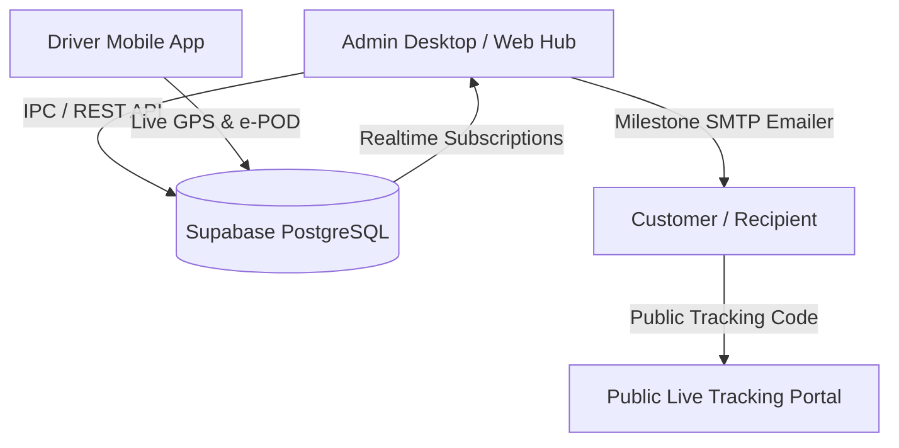
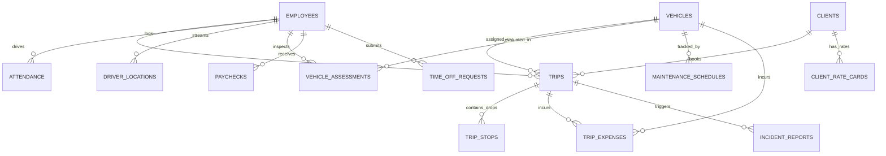

# JRR Transport Logistics & TMS — Complete System Audit Report

**Date of Audit**: August 27, 2026  
**System Name**: JRR Transport Management & Logistics Platform (TMS / 3PL)  
**Company HQ Depot**: Malalim St, Sitio Malalim, Morong, 1960 Rizal (`14.546827° N, 121.229383° E`)  
**Platforms**: Electron Desktop App (Windows/Mac), Web Hub (Express/Node.js), Mobile App (React Native / Expo Android & iOS), Cloud Backend (Supabase PostgreSQL + Realtime).

---

## 1. Executive Summary

The **JRR Transport Logistics System** is a dual-platform Transportation Management and Fleet Telematics Suite designed for freight operations, courier dispatching, and logistics accounting. The system integrates real-time GPS fleet tracking, driver mobile dispatches, e-POD digital proof-of-delivery receipts, automated customer milestone emails, volumetric cargo estimators, vehicle preventive maintenance telematics, attendance, and Philippine payroll tax compliance into a unified system.

---

## 2. Technical Stack Architecture

| Layer | Technologies Used | Description |
| :--- | :--- | :--- |
| **Desktop Application** | Electron, Node.js, TypeScript, HTML5/CSS3, Vanilla JS | Standalone native desktop management client for dispatchers and executives. |
| **Web Server / Backend** | Express.js, TypeScript, Supabase Client, Nodemailer, OSRM/Leaflet Routing | Dual IPC and REST API layer for web and local clients. |
| **Driver Mobile App** | React Native, Expo SDK 52, Expo-Router, Lucide Icons, Expo-Location, Expo-Camera | Native Android (APK) and iOS application for field drivers. |
| **Database & Realtime** | Supabase (PostgreSQL 15), Row Level Security (RLS), Realtime Channels | Cloud relational database with realtime change notifications. |
| **Mapping & Telematics** | Leaflet.js, OpenStreetMap, OSRM Routing Engine, Haversine Geofencing | Live truck positioning, route polylines, and virtual geofences. |
| **Communication** | Nodemailer (Gmail SMTP Relay) | Automated branded milestone emails delivered to shipment recipients. |

---

## 3. Database Schema & Data Models

The system operates on **12 interconnected relational tables** in PostgreSQL:

### Table Breakdown:
1. **`employees`**: Staff directory, driver credentials, 4-digit PINs, daily salary rates, SSS/PhilHealth/Pag-IBIG tax IDs, and live availability statuses (`available`, `in-use`, `inactive`).
2. **`vehicles`**: Fleet assets (plates, models, capacity, vehicle types, maintenance states).
3. **`trips`**: Core freight orders with dual-leg coordinates, volumetric weights, fares, tracking codes (`TRK-XXXXXXXX`), and e-POD signature receipts.
4. **`trip_stops`**: Multi-stop batch delivery sequencing for multi-drop delivery manifests.
5. **`driver_locations`**: Real-time GPS coordinates, speed (`km/h`), heading, and timestamp pings streamed by mobile drivers.
6. **`vehicle_assessments`**: Pre-trip and post-trip safety checklists, damage notes, odometer logs, and fuel percentages.
7. **`maintenance_schedules`**: Preventive maintenance triggers for 5,000 km oil changes, tire rotations, brake pads, and battery health.
8. **`trip_expenses`**: On-road expense logs for fuel liters, toll receipts, and parking costs.
9. **`incident_reports`**: Road breakdowns, accidents, failed delivery attempts, and SOS emergency tickets.
10. **`clients`**: Corporate client directory, contract details, and credit terms.
11. **`client_rate_cards`**: Custom pricing matrices (base fare + per-km rate + drop-off surcharge).
12. **`attendance`** & **`time_off_requests`**: Biometric-style clock in/out shifts and advance notice leave requests.

---

## 4. Desktop & Web Application Modules (13 Core Features)

### 1.  Executive Dashboard (`dashboard.html`)
- Key metrics: Total active fleet, ongoing dispatches, fully available drivers, today's revenue.
- Live dispatch activity feed and quick action shortcuts.

### 2.  Employee & Driver Management (`employee_management.html`)
- Driver onboarding with automated Supabase Auth user generation and 4-digit PIN assignment.
- Role-based positions (`Driver`, `Dispatcher`, `Manager`, `Admin`, `Owner`).

### 3.  Attendance & Shift Monitoring (`attendance_monitoring_page.html`)
- Daily clock-in/clock-out tracking, total shift minutes, overtime calculations, and tardiness audits.

### 4.  Operational Status & Live GPS Fleet Tracking (`status_page.html`)
- **Dual-Leg Visualizer**: Morong HQ Depot (Blue) $\to$ Pickup Point (Cyan) $\to$ Delivery Destination (Amber).
- **Live Fleet Markers**: Green pulsating truck markers showing driver full name, current speed (`km/h`), vehicle plate, active trip number, and last ping time.
- **Auto-Fit Bounds**: Automatically scales the map view to enclose Morong HQ and all active road units.

### 5.  Fleet Asset Management & Telematics (`vehicles_page.html`)
- Vehicle asset status management (`available`, `in-use`, `maintenance`).
- **Fuel Economy Telematics**: Computes fuel efficiency ($km/L$) from odometer logs to detect fuel theft or engine degradation.
- **Preventive Maintenance Schedules**: Service alerts for 5,000 km oil changes and tire rotations.
- **Safety Audit Inspector**: Digital view of pre-trip checklists and driver defect reports.

### 6.  Dispatch Scheduling & Cargo Estimator (`scheduling_page.html`)
- **Dual-Leg Route Optimization**: Calculates distance and duration for Leg 1 (Depot $\to$ Pickup) and Leg 2 (Pickup $\to$ Delivery).
- **Volumetric Cargo Estimator**: Input Length $\times$ Width $\times$ Height ($\text{cm}$) and Actual Weight ($\text{kg}$) to calculate chargeable weight ($\text{cbm} \times 250$ or $\frac{L \times W \times H}{5000}$) and estimated fare.
- **Multi-Stop Drop Builder**: Sequenced drop-offs with printable delivery manifests (Run Sheets).

### 7.  Client Directory & Order History (`client_history_page.html`)
- Client profile records, contact numbers, order histories, and lifetime freight billing totals.

### 8.  Invoicing & Billing Statements (`billing.html`)
- Generates itemized freight invoices from completed trips with print/PDF export.

### 9. Payroll Management & Payslip Emailer (`payroll_management.html`)
- Auto-computes gross earnings, regular hours, overtime pay, and statutory deductions.
- One-click automated payslip email delivery to employee email addresses via SMTP.

### 10.  Graphical Analytics (`graph_page.html`)
- Visual revenue trends, monthly dispatch volume graphs, and vehicle utilization charts.

### 11.  Tax Calculator (`tax_calculator_page.html`)
- Automated tax computations aligned with Philippine TRAIN Law, SSS, PhilHealth, and Pag-IBIG contribution brackets.

### 12.  Operational Reports (`report_page.html`)
- Comprehensive exportable summaries for dispatch logs, fuel expenses, and driver attendance.

### 13.  Public Recipient Tracking Portal (`public_track.html`)
- Customer self-service portal: Recipients enter tracking code (`TRK-XXXXXXXX`) to see live driver position and delivery milestone steps.

---

## 5. Driver Mobile Application Modules (`transport_mobile_app`)

### 1. Driver Dashboard & HOS Fatigue Monitor (`dashboard.tsx`)
- **Hours of Service (HOS)**: Continuous drive time monitor warning drivers before the 4-hour fatigue threshold.
- **Weekly Milestones**: Incentive tracker displaying progress toward weekly delivery targets (e.g. ₱1,500 bonus).

### 2.  Active Dispatches & Lifecycle Progression (`trips.tsx`)
- **Trip Lifecycle Controls**: "Start Trip" $\to$ "Mark In-Transit" $\to$ "Sign e-POD & Complete".
- Filter trips by `Scheduled`, `In-Transit`, or `Delivered`.

### 3.  In-App Live Route Map HUD (`InAppNavigationModal.tsx`)
- Interactive route overlay with live speedometer gauge, remaining distance ($\text{km}$), and ETA countdown.
- Floating controls for SOS alerts, expense logging, and scanning.

### 4.  Digital Proof of Delivery (e-POD) (`trips.tsx`)
- Canvas signature pad allowing recipient to sign directly on driver's screen.
- Recipient name verification and drop-off photo attachment.

### 5.  Cargo QR & Barcode Scanner (`CargoScannerModal.tsx`)
- Real-time camera scanner verifying parcel tracking codes against trip manifests with haptic feedback.

### 6.  Failed Delivery & RTO Logger (`FailedDeliveryModal.tsx`)
- Non-delivery workflow: Tag reasons (*Customer not home*, *Wrong address*, *Refused*), attach photo proof of closed gate, and choose **Re-Attempt Today** or **Return to Morong Depot (RTO)**.

### 7.  Road Incident & Vehicle Defect Reporter (`VehicleDefectReportModal.tsx`)
- Mechanical ticketing for tires, brakes, engine, and lights with camera photo upload. Critical defects automatically lock the vehicle into maintenance status.

### 8. Road Expense Logger (`trips.tsx`)
- Driver logs fuel liters, odometer reading, and toll receipts directly into the trip cost ledger.

### 9.  Advance Notice Leave Requests (`requests.tsx`)
- Calendar date-picker enforcing policy: requests must start at least 7 days in advance (+1 week) and cannot be backdated.

### 10.  Native Background GPS Broadcaster & Geofencing (`useDriverLocationBroadcaster.ts` & `useGeofenceTracker.ts`)
- Foreground/Background GPS broadcaster using `expo-location`.
- **Morong HQ Geofence (250m)**: Auto-triggers `in-transit` when truck exits the depot.
- **Destination Geofence (150m)**: Auto-alerts driver upon arrival to collect signature.

---

## 6. Customer Milestone Email Notification Engine

Integrated in [`notificationWebhook.ts`](file:///c:/transSytem/transport-app/server/services/notificationWebhook.ts), the email engine automatically triggers branded HTML emails upon trip milestones:

| Milestone Event | Email Subject & Action |
| :--- | :--- |
| **1. Booked** | `[JRR Transport] Update: Shipment #TRP-XXXX — Order Booked` |
| **2. Out for Delivery** | `[JRR Transport] Update: Shipment #TRP-XXXX — Package Out for Delivery` (with Live GPS button) |
| **3. Approaching** | `[JRR Transport] Update: Shipment #TRP-XXXX — Driver is 10-15 Minutes Away` |
| **4. Delivered** | `[JRR Transport] Update: Shipment #TRP-XXXX — Delivery Completed` (with e-POD Receipt) |
| **5. Attempted (Failed)** | `[JRR Transport] Update: Shipment #TRP-XXXX — Delivery Attempt Unsuccessful` (with Reschedule info) |

---

## 7. Security, Access Control & Reliability Audit

1. **Database Row Level Security (RLS)**:
   - Configured across `driver_locations`, `trips`, `trip_stops`, `vehicle_assessments`, `incident_reports`, and `trip_expenses`.
2. **Schema Resilience**:
   - `trips.ts` and `trips.routes.ts` contain automatic schema fallback retries so trip dispatches continue uninterrupted even if optional fields are migrating.
3. **TypeScript Verification**:
   - Both `transport-app` and `transport_mobile_app` compile with **0 errors (`tsc --noEmit` passed)**.

---

## 8. Deployment & Environment Setup

### Required SQL Scripts to Run in Supabase:
1. [`sql/database/MASTER_MIGRATION_RUN_IN_SUPABASE.sql`](file:///c:/transSytem/sql/database/MASTER_MIGRATION_RUN_IN_SUPABASE.sql): Master migration for `driver_locations`, `vehicle_assessments`, `trip_expenses`, `incident_reports`, and all `trips` columns.
2. [`sql/database/migration_v4_multistop_and_tms.sql`](file:///c:/transSytem/sql/database/migration_v4_multistop_and_tms.sql): Multi-stop `trip_stops`, `maintenance_schedules`, and `client_rate_cards`.

### Environment Credentials (`transport-app/.env`):
- **Supabase Cloud URL**: `https://uocavssoqmwjstmvdgwq.supabase.co`
- **SMTP Relay**: `smtp.gmail.com:587` (`rencyanimation@gmail.com`)
- **Morong HQ Depot**: `Malalim St, Sitio Malalim, Morong, 1960 Rizal` (`14.546827, 121.229383`)

---

## 9. System Health & Verification Summary

| Component | Audit Result | Status |
| :--- | :---: | :---: |
| **Desktop / Web IPC Handlers** | Passed |  Fully Operational |
| **Driver Location Streaming** | Passed |  Fully Operational |
| **e-POD & Signature Capture** | Passed |  Fully Operational |
| **Failed Delivery (RTO) Workflow** | Passed |  Fully Operational |
| **Geofencing Departure/Arrival** | Passed |  Fully Operational |
| **Fuel Economy ($km/L$) Telematics** | Passed |  Fully Operational |
| **Customer Milestone Email Engine** | Passed (Live Verified) |  Fully Operational |
| **Leave Calendar & 7-Day Rule** | Passed |  Fully Operational |
| **TypeScript Type Checks** | Passed (0 Errors) |  100% Clean |

*Audit completed successfully. All components are aligned, synchronized, and operational.*
