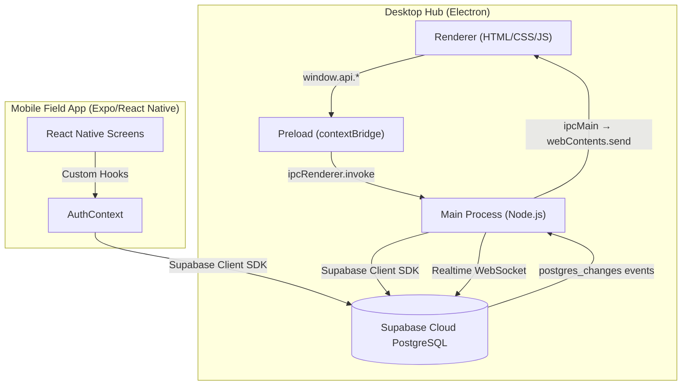
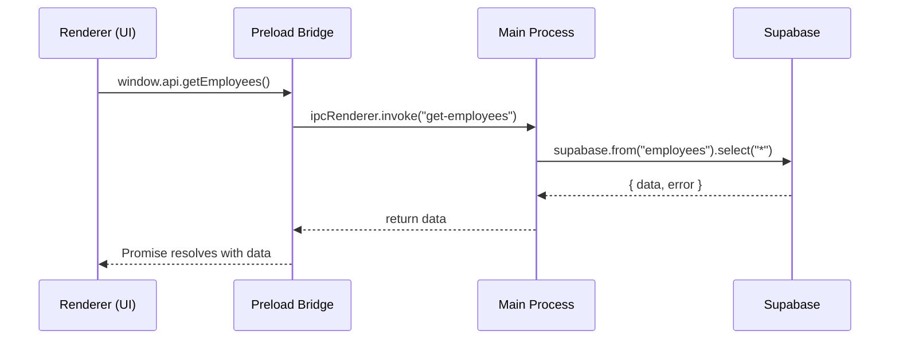
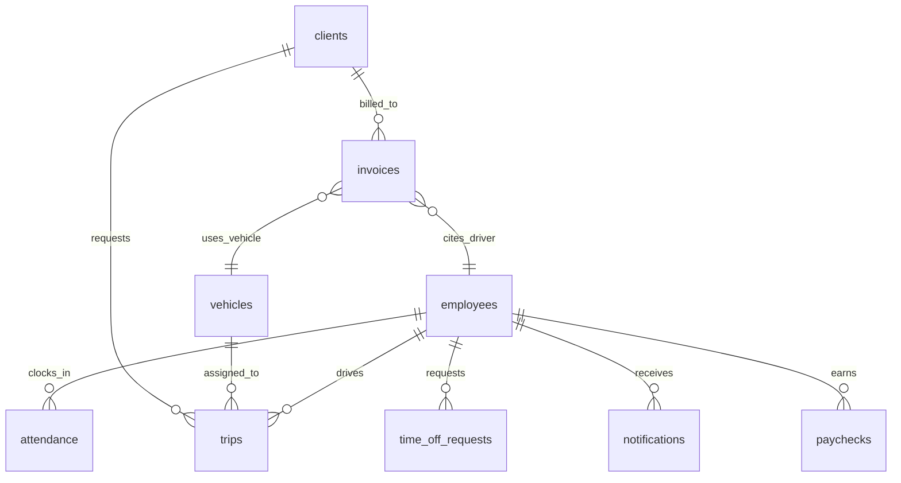
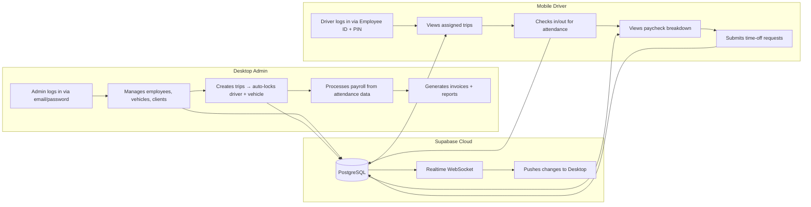

# JRR Transport System — Full System Logic Analysis

## 1. High-Level Architecture

The system is a **dual-application platform** for logistics/fleet management:



| Component | Tech Stack | Purpose |
|---|---|---|
| **Desktop Hub** | Electron + TypeScript + Vanilla HTML/CSS/JS | Admin operations: HR, fleet, payroll, billing, scheduling |
| **Mobile App** | Expo (React Native) + TypeScript | Field operations: driver check-in, trips, paycheck viewing |
| **Backend/DB** | Supabase (PostgreSQL + Auth + Realtime) | Single source of truth — no custom server |

> [!IMPORTANT]
> There is **no custom backend server**. Both apps talk directly to Supabase. The Electron main process acts as a "backend" only for the desktop app via IPC.

---

## 2. Desktop Hub — How It Works

### 2.1 Application Bootstrap

The lifecycle starts in [main.ts](file:///c:/transSytem/transport-app/main.ts):

1. **`app.whenReady()`** fires → calls:
   - `setupAllIPC()` — registers all IPC handlers
   - `createWindow()` — opens the BrowserWindow (1900×900, context-isolated, no node integration)
   - `setupRealtimeSubscriptions()` — listens to Supabase Realtime channels

2. **Window loads** `renderer/html/index.html` (the login page)

3. **Security model**: `contextIsolation: true` + `nodeIntegration: false`. The renderer has zero access to Node.js — everything goes through the preload bridge.

### 2.2 The IPC Communication Model

This is the **core architectural pattern** of the desktop app:



The three layers are:

| Layer | File | Role |
|---|---|---|
| **Preload** | [preload.ts](file:///c:/transSytem/transport-app/preload.ts) | Exposes `window.api` object with ~35 methods via `contextBridge` |
| **IPC Registry** | [ipc/index.ts](file:///c:/transSytem/transport-app/ipc/index.ts) | Central `setupAllIPC()` that registers all handler modules |
| **Handler Modules** | `ipc/auth.ts`, `employees.ts`, `vehicles.ts`, etc. | Each module registers its own `ipcMain.handle()` listeners |

### 2.3 Two Supabase Clients

Defined in [ipc/utils.ts](file:///c:/transSytem/transport-app/ipc/utils.ts):

| Client | Key Used | Purpose |
|---|---|---|
| `supabase` | `SUPABASE_KEY` (anon) | Normal operations — subject to RLS |
| `supabaseAdmin` | `SUPABASE_SERVICE_ROLE_KEY` | Bypasses RLS — used for admin operations (create employee auth accounts, attendance queries, time-off management) |

The `handleSupabase()` utility wraps every Supabase call with standardized error handling, returning `{ success, ok, data, error, message }`.

### 2.4 Realtime Subscriptions

The main process subscribes to 3 Supabase Realtime channels:
- `trips` table changes
- `vehicles` table changes  
- `employees` table changes

When any row changes, the main process **forwards the event to all open renderer windows** via `webContents.send("realtime-update", ...)`. The renderer listens via `window.api.onRealtime(callback)`.

---

## 3. Authentication — Dual-Layer System

### 3.1 Desktop Login ([ipc/auth.ts](file:///c:/transSytem/transport-app/ipc/auth.ts))

The desktop login has a **two-tier fallback**:

```
Step 1: Try Supabase Auth (email + password)
  ├── Success → look up employee by supabase_user_id → return employee record
  └── Fail ↓
Step 2: Fallback to "users" table (plain-text email + password match)
  ├── Found → return user record (admin profile)
  └── Not found → return null (login fails)
```

> [!WARNING]
> The `users` table fallback stores **plaintext passwords** and uses a direct `eq("password", password)` match. This is the admin/legacy login path.

### 3.2 Mobile Login ([AuthContext.tsx](file:///c:/transSytem/transport_mobile_app/contexts/AuthContext.tsx))

The mobile login is **PIN-based** for drivers:

```
1. User enters Employee ID (e.g. "EMP0008") + 4-digit PIN
2. System looks up employee row by employee_id
3. Compares entered PIN against employee_pin4 (DB-generated column = last 4 chars of employee_id)
4. Converts PIN to Supabase password: "EMP" + PIN (e.g. "EMP0008")
5. Calls supabase.auth.signInWithPassword(email, password)
6. If auth fails + no supabase_user_id exists → auto-registers via signUp
7. If auth fails due to DB trigger errors → creates a local "Mock Session" from AsyncStorage
8. Links employee.supabase_user_id if not already set
9. Validates employee status is "active", "available", or "in-use"
```

### 3.3 Employee Identity Rules

| Concept | Pattern | Example |
|---|---|---|
| Employee ID | `EMPXXXX` | `EMP0008` |
| PIN | Last 4 digits of employee_id | `0008` |
| Auth Password | `EMP` + PIN | `EMP0008` |
| `employee_pin4` | Database-generated column (`GENERATED ALWAYS AS right(employee_id, 4)`) | `0008` |

Auto-sequencing: The `get-next-employee-id` handler finds the highest existing `EMPXXXX` number and returns `max + 1`, padded to 4 digits.

### 3.4 Mobile Resiliency Model

The mobile app handles **unstable network conditions** for field drivers:

| Scenario | Behavior |
|---|---|
| Normal login | Supabase Auth → hydrate employee → set session |
| Network timeout on restore | 10-second watchdog timer → falls back to `AsyncStorage` mock session |
| Auth service rejects user (DB trigger errors) | Bypasses auth, creates verified mock session from PIN-validated employee data |
| Session exists but no employee profile found (no network error) | Force sign out — unverified identity |
| Session exists but employee lookup fails (network error) | Preserves auth state, sets employee=null — recoverable on restart |

---

## 4. Database Schema

9 core tables in Supabase PostgreSQL:



| Table | Key Fields | Notes |
|---|---|---|
| `employees` | `id` (uuid), `employee_id` (text, e.g. EMP0008), `supabase_user_id`, `daily_rate`, `employee_pin4` (generated) | Core identity table |
| `vehicles` | `id`, `plate`, `brand`, `model`, `status` (available/in-use/maintenance/retired) | Fleet registry |
| `trips` | `id`, `trip_number`, `driver_id` → employees, `vehicle_id` → vehicles, `client_id` → clients, `status`, `trip_type`, `cargo` | Logistics operations |
| `attendance` | `employee_id` → employees, `date`, `check_in`, `check_out` | Time tracking |
| `clients` | `id`, `name`, `email`, `client_type`, `company_name` | Customer registry |
| `invoices` | `invoice_number`, `client_id`, `driver_id`, `vehicle_id`, `amount`, `status` | Billing records |
| `time_off_requests` | `employee_id`, `request_type`, `start_date`, `end_date`, `status` | HR requests |
| `notifications` | `employee_id`, `title`, `message`, `type`, `is_read` | Push alerts for mobile |
| `paychecks` | `employee_id`, `gross_pay`, `deductions`, `net_pay`, `hours_worked` | Payroll records |
| `users` | `username`, `email`, `password` (plaintext) | Admin login fallback |

There is also an RPC function `insert_attendance()` for safe check-in inserts.

---

## 5. Business Logic by Module

### 5.1 Employee Management ([ipc/employees.ts](file:///c:/transSytem/transport-app/ipc/employees.ts))

- **CRUD**: Full create/read/update/delete
- **`create-employee`**: High-privilege operation using `supabaseAdmin`:
  1. Creates a Supabase Auth user via `admin.createUser()` (email-confirmed immediately)
  2. Inserts employee profile with `supabase_user_id` link
  3. Auto-sets `hire_date` to today
- **`sync-employee-account-by-email`**: Links an existing employee to a Supabase auth account (or creates one if none exists)
- **`employee_pin4`** is never written manually — it's stripped from insert/update payloads because it's a `GENERATED ALWAYS` column

### 5.2 Trip Management ([ipc/trips.ts](file:///c:/transSytem/transport-app/ipc/trips.ts))

- **Side effects on create**: When a trip is created, the assigned driver and vehicle are automatically set to `"in-use"` status
- **Side effects on completion**: When a trip status changes to `"completed"` or `"delivered"`, the driver and vehicle are reset to `"available"`
- This creates an **automatic resource allocation system** — vehicles and drivers are locked while on a trip

### 5.3 Payroll Engine ([ipc/payroll.ts](file:///c:/transSytem/transport-app/ipc/payroll.ts))

Payroll is **computed on-the-fly** from attendance data — not stored as a snapshot:

```
For each employee in a given month:
  1. Fetch all attendance rows (check_in, check_out)
  2. Calculate hours worked per day: (check_out - check_in) in hours
  3. Day pay = daily_rate × min(hours / 8, 1)  ← capped at 1 full day
  4. Gross pay = sum of all day amounts
  5. Net pay = gross pay (bonus and deductions are placeholders at 0)
```

Two endpoints:
- `payroll:getMyMonthly` — single employee's payslip (used by mobile)
- `payroll:getMonthlyAll` — organization-wide payroll report (used by desktop admin)

### 5.4 Billing/Invoicing ([ipc/index.ts](file:///c:/transSytem/transport-app/ipc/index.ts#L76-L118))

- Full CRUD for invoices
- `billing:getAll` joins with `clients`, `employees`, and `vehicles` for rich display
- `billing:getLastNumber` enables auto-incrementing invoice numbers
- `billing:getStats` computes total revenue and count of unpaid invoices

### 5.5 Attendance & Time-Off ([ipc/requests.ts](file:///c:/transSytem/transport-app/ipc/requests.ts))

- Attendance queries use `supabaseAdmin` to **bypass RLS** — this was an intentional fix for visibility issues
- `get-all-attendance` supports filtering by employee, start date, end date, and joins employee names
- **`recalculate-statuses`**: A bulk updater that automatically transitions time-off request statuses:
  - Past `end_date` → `"Completed"`
  - Current date between start/end → `"Ongoing"`  
  - Future `start_date` → `"Pending"`

### 5.6 Dashboard ([ipc/index.ts](file:///c:/transSytem/transport-app/ipc/index.ts#L52-L73))

Aggregates 4 KPIs via `Promise.all`:
- Total employees
- Total clients
- Total vehicles
- Today's trips (filtered by `pickup_time >= today`)

---

## 6. Desktop Renderer (Frontend)

### 6.1 Module Structure

17 HTML pages, each with a paired `.js` controller and `.css` stylesheet:

| Category | Pages |
|---|---|
| **Auth** | `index.html` (login), `signup_page.html`, `forgot_password_page.html` |
| **Core Dashboard** | `dashboard.html`, `landingpage.html` |
| **Operations** | `scheduling_page.html`, `vehicles_page.html`, `status_page.html` |
| **HR** | `employee_management.html`, `attendance_monitoring_page.html`, `payroll_management.html` |
| **Finance** | `billing.html`, `tax_calculator_page.html` |
| **Analytics** | `report_page.html`, `graph_page.html` |
| **CRM** | `client_history_page.html` |

### 6.2 Frontend Patterns

- **`auth_guard.js`**: Protects pages from unauthorized access
- **`sidebar.js` + `sidebarPaths.js`**: Navigation system mapping sidebar items to pages
- **`page_loader.js`**: Handles dynamic page loading
- **`loader.js` + `ui_loader.js`**: Loading overlay with 500ms minimum display threshold (anti-flicker)
- **`export_utils.js`**: Data export functionality
- **`theme.js`**: HSL-based theme switching via CSS variables (`--primary-h`, etc.)
- **Design system**: All tokens in `variables.css`, shared layouts in `shared.css`

---

## 7. Mobile App Structure

### 7.1 Navigation (Expo Router — file-based)

```
app/
├── _layout.tsx          → Root layout (AuthProvider wrapper + navigation guards)
├── auth/
│   └── login.tsx        → PIN-based login screen
└── (tabs)/
    ├── _layout.tsx      → Tab bar configuration
    ├── dashboard.tsx    → Daily overview
    ├── trips.tsx        → Trip viewer/status updates
    ├── attendance.tsx   → GPS check-in/out
    ├── paycheck.tsx     → Monthly salary breakdown
    ├── requests.tsx     → Time-off/HR requests
    ├── notification.tsx → Alerts & notifications
    └── profile.tsx      → Employee profile & settings
```

### 7.2 State Management

| File | Role |
|---|---|
| `AuthContext.tsx` | Global auth state: session, employee data, sign in/out, refresh |
| `useSession.tsx` | Session utility hook |
| `lib/supabase.ts` | Supabase client initialization for mobile |

### 7.3 Navigation Guards

The root `_layout.tsx` enforces:
- If `loading` → show splash/loading screen
- If no `session` → redirect to `/auth/login`
- If `session` but no `employee` → stuck state (covered by mock session fallback)
- If `session` + `employee` → allow access to `(tabs)`

---

## 8. Data Flow Summary



---

## 9. Key Design Decisions & Trade-offs

| Decision | Rationale | Trade-off |
|---|---|---|
| No custom backend | Supabase handles auth, DB, realtime — reduces infra | Limited to Supabase capabilities; service-role key in desktop app |
| Dual Supabase clients (anon + admin) | RLS bypass needed for cross-employee queries | Service role key bundled in Electron app resources |
| Plaintext password in `users` table | Legacy admin login compatibility | Security risk — should be migrated to Supabase Auth only |
| Payroll computed on-the-fly | Always reflects latest attendance data | Potentially slow for large datasets; no historical snapshots |
| Mock session fallback (mobile) | Handles field conditions with poor connectivity | Stale data possible; no true offline writes |
| `employee_pin4` as generated column | Single source of truth — PIN always derived from employee_id | PIN is predictable (last 4 digits of ID) |
| Trip side-effects (auto-lock resources) | Prevents double-booking of drivers/vehicles | No explicit transaction — partial failures possible |
